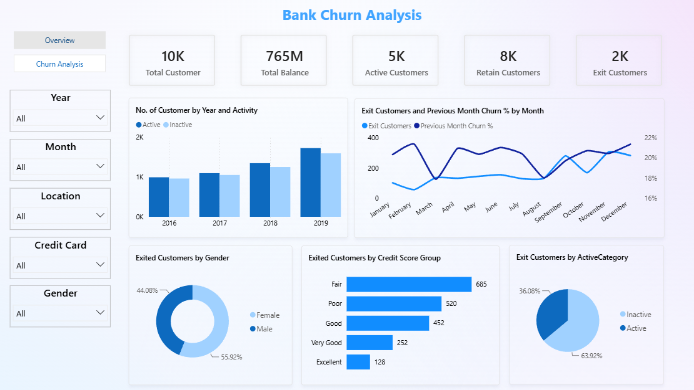

# 🏦 Bank Churn Analysis — Power BI Dashboard

An interactive **Bank Customer Churn Analysis Dashboard** built using **Microsoft Power BI** to analyze customer retention, churn behavior, activity levels, credit scores, demographics, and churn trends over time.

---

## 📊 Project Overview

Customer churn is an important business problem for banks because losing existing customers can significantly impact revenue and long-term growth.

This project uses **Power BI, Power Query, and DAX** to transform customer data into an interactive dashboard that helps identify:

* Customer churn and retention patterns
* Active vs. inactive customers
* Churn trends over time
* Customer exits by gender
* Churn across credit score groups
* Relationship between customer activity and exits
* Key customer segments with higher churn rates

The dashboard is designed to support **data-driven customer retention and business decision-making**.

---

## 🎯 Project Objectives

The main objectives of this project are:

* Analyze the overall customer churn rate.
* Understand customer retention and activity patterns.
* Identify customer churn trends by month and year.
* Compare exited customers by gender.
* Analyze customer exits across different credit score groups.
* Understand the relationship between customer activity and churn.
* Build an interactive dashboard for business analysis.
* Provide actionable insights that can support customer retention strategies.

---

## 📌 Dashboard Features

### 🔹 KPI Cards

The dashboard provides a quick overview of the customer base through key performance indicators.

| KPI                   | Value |
| --------------------- | ----: |
| 👥 Total Customers    |   10K |
| 💰 Total Balance      |  765M |
| 🟢 Active Customers   |    5K |
| 🔵 Retained Customers |    8K |
| 🔴 Exited Customers   |    2K |

> **Note:** KPI values are rounded for dashboard presentation.

---

### 🔹 Customer Activity by Year

A clustered column chart compares **Active** and **Inactive** customers across different years.

This visualization helps identify changes in customer engagement and activity levels over time.

**Metrics analyzed:**

* Active Customers
* Inactive Customers
* Year-wise customer activity

---

### 🔹 Monthly Churn Analysis

A line chart is used to analyze customer exits and month-over-month churn behavior.

The visualization includes:

* Exit Customers by Month
* Previous Month Churn %
* Monthly churn fluctuations

This helps identify periods where customer exits increase and allows businesses to investigate potential causes of higher churn.

---

### 🔹 Exited Customers by Gender

A donut chart shows the gender distribution of customers who exited the bank.

| Gender    | Exit Share |
| --------- | ---------: |
| 👩 Female |     55.92% |
| 👨 Male   |     44.08% |

Female customers represent a slightly higher proportion of exited customers compared with male customers.

---

### 🔹 Exited Customers by Credit Score

Customers who exited are categorized based on their credit score.

| Credit Score Group | Exited Customers |
| ------------------ | ---------------: |
| Fair               |              685 |
| Poor               |              520 |
| Good               |              452 |
| Very Good          |              252 |
| Excellent          |              128 |

The **Fair credit score group** has the highest number of exited customers.

---

### 🔹 Exit Customers by Activity Category

The dashboard compares exited customers based on their activity status:

* 🟢 Active
* 🔴 Inactive

The analysis indicates that **inactive customers account for the larger share of customer exits**.

This suggests that customer engagement may be an important factor associated with churn.

---

## 🎛️ Interactive Filters

The dashboard includes interactive slicers that allow users to explore customer churn across different segments.

Available filters include:

* 📅 Year
* 📆 Month
* 📍 Location
* 💳 Credit Card
* 👤 Gender

These filters allow users to perform detailed analysis and identify specific customer segments with higher churn.

---

## 📈 Key Insights

The dashboard highlights several important findings:

### 1. Customer Retention

Approximately **8K customers were retained**, while around **2K customers exited**.

This provides an overall view of the bank's customer retention and churn situation.

### 2. Overall Customer Base

The bank has approximately **10K customers** represented in the dataset.

### 3. Customer Balance

The total customer balance is approximately **765M**, indicating a significant amount of customer-held funds represented in the dataset.

### 4. Gender-Based Churn

Female customers account for approximately **55.92% of exited customers**, compared with **44.08% for male customers**.

### 5. Credit Score and Churn

Customers in the **Fair credit score group** have the highest number of exits, with **685 exited customers**.

This segment may require further investigation to understand the factors contributing to churn.

### 6. Customer Activity and Churn

**Inactive customers represent the larger share of exited customers**, suggesting a potential relationship between customer engagement and churn.

### 7. Monthly Churn Trends

Customer exits fluctuate across different months.

Analyzing month-over-month churn can help identify periods of increased customer exits and support proactive retention strategies.

---

## 💡 Business Recommendations

Based on the dashboard findings, banks could consider the following strategies:

* **Target inactive customers** with personalized engagement campaigns.
* Develop retention programs for customers showing early signs of inactivity.
* Investigate why customers in the **Fair credit score segment** have higher exit rates.
* Analyze churn patterns by location and customer demographics.
* Monitor monthly churn trends to identify unusual increases in customer exits.
* Develop personalized offers and services for high-value customers.
* Use customer activity data to identify customers who may be at risk of leaving.

---

## 🛠️ Tools & Technologies

This project was developed using:

| Technology             | Purpose                                  |
| ---------------------- | ---------------------------------------- |
| **Microsoft Power BI** | Dashboard development & visualization    |
| **Power Query**        | Data cleaning & transformation           |
| **DAX**                | Calculated columns & analytical measures |
| **Data Visualization** | Interactive charts & KPIs                |
| **Data Analysis**      | Customer churn & retention analysis      |

---

## 📊 Dashboard Preview




---

## 📂 Project Structure

```text
Bank-Churn-Analysis/
│
├── README.md
│
├── Bank
.pbix
│
├── Bank_Churn.csv
│
└── image.png
```

### File Description

| File                  | Description                   |
| --------------------- | ----------------------------- |
| `README.md`           | Project documentation         |
| `Bank Dashboard.pbix` | Power BI dashboard file       |
| `Bank_Churn.csv`      | Source customer churn dataset |
| `image.png`           | Dashboard preview image       |

---

## 🚀 How to Use

1. Clone or download this repository.
2. Open **Microsoft Power BI Desktop**.
3. Open the `Bank Dashboard.pbix` file.
4. Explore the dashboard using the available filters and visualizations.
5. Use the slicers to analyze churn across different customer segments.

---

## 📌 Conclusion

The **Bank Churn Analysis Dashboard** provides an interactive way to understand customer churn and retention behavior.

By analyzing customer activity, credit score, gender, location, and monthly churn trends, the dashboard helps identify customer segments that may require additional attention.

The insights generated from this analysis can support banks in developing **targeted customer retention strategies, improving engagement, and reducing customer churn**.

---

## 👨‍💻 Project

**Bank Churn Analysis — Power BI Dashboard**

**Tools:** Power BI • Power Query • DAX • Data Analysis • Data Visualization

---
