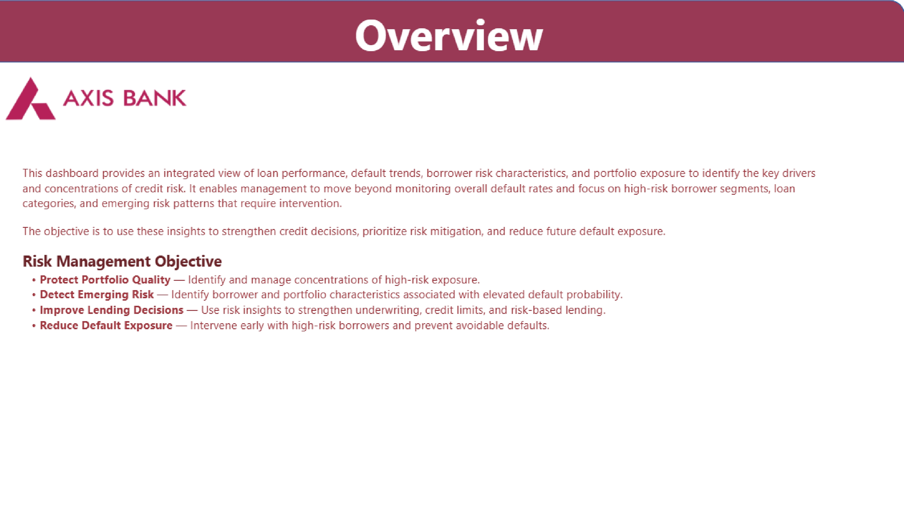
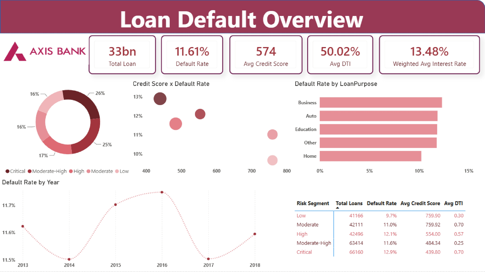
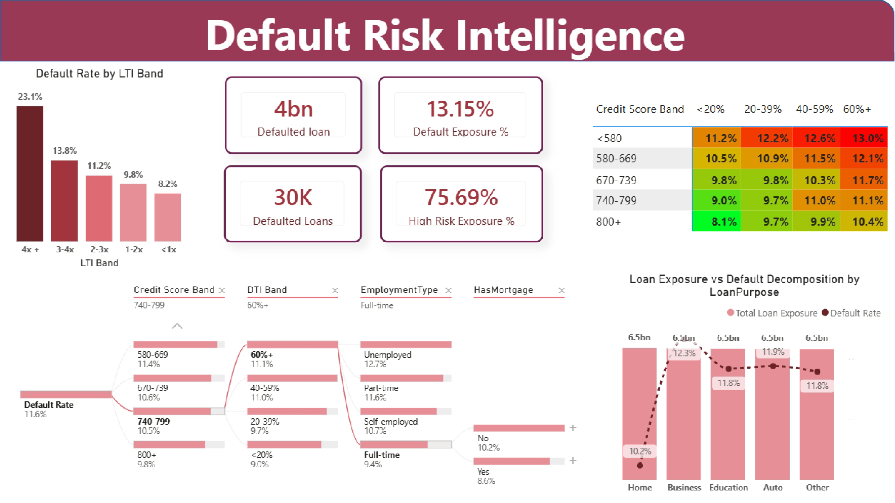
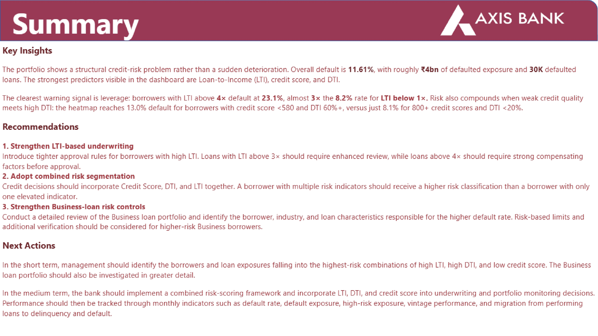

# Axis Bank Loan Portfolio \& Credit Risk Analysis

## Project Overview

This project analyzes a **Loan Portfolio** from a credit-risk and portfolio-management perspective. The objective is to identify the key drivers of **loan defaults**, understand borrower risk characteristics, detect high-risk segments, and provide actionable recommendations for improving lending and risk-management decisions.

The final output is an interactive Power BI dashboard designed to help management move beyond monitoring overall default rates and identify the specific borrower segments and loan categories contributing to elevated credit risk.

- **Business Problem** -Financial institutions need to continuously monitor their loan portfolios to identify borrowers and loan segments that have a higher probability of default.

**Dashboard Structure**
The Power BI dashboard is organized into four major sections.

## 1\. Portfolio Overview
 This section provides an overall view of the loan portfolio and establishes the current credit-risk position.

  

## 2\. Loan Default Overview 
This page focuses on understanding where defaults are concentrated.

  

## 3\. Default Risk Intelligence
 This section focuses on identifying the strongest risk indicators and combinations of risk factors.

  

- LTI Analysis Loan-to-Income (LTI) is analyzed across multiple bands:   <1x  1–2x  2–3x  3–4x  4x+

## 4\. Default Risk Intelligence  
This section tells the conclusion and actions to do 

  

## Tools \& Technologies Used :

- **Power BI -** Dashboard development and data visualization 
- **Power Query -** Data transformation and preparation 
- **DAX -** KPI calculations, measures and analytical logic 
- **Excel / CSV -** Data source and supporting analysis

## How to Use the Project

**Clone the repository git clone** https://github.com/your-username/axis-bank-credit-risk-analysis.git

**Open:**
dashboard.pbix
using Power BI Desktop.

**Connect the Data**
If the dataset is included separately, update the Power BI data-source path to: data/loan.csv 

**Explore the Dashboard**
Use the available filters and visual interactions to analyze:

## Conclusion

This project demonstrates how loan portfolio data can be transformed into actionable credit-risk insights. The analysis identifies LTI, credit score, and DTI as important risk indicators and highlights the importance of evaluating these variables together. The most significant risk signal is high leverage, with borrowers having LTI above 4x showing substantially higher default rates. The analysis also identifies elevated risk within certain loan-purpose segments, particularly Business loans. The resulting dashboard provides management with a structured framework for identifying high-risk borrowers, monitoring portfolio exposure, strengthening underwriting decisions, and reducing future default risk.

## Important Note 
This project is intended for portfolio, educational, and analytical demonstration purposes. The dashboard uses the project dataset and should not be interpreted as an official analysis, recommendation, or risk assessment of Axis Bank's actual loan portfolio.

