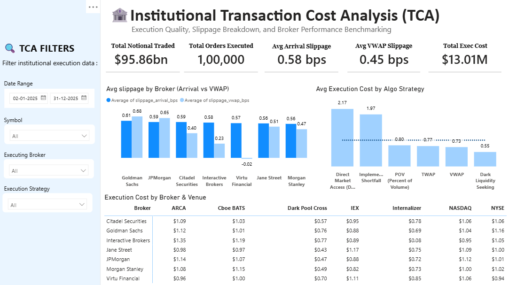
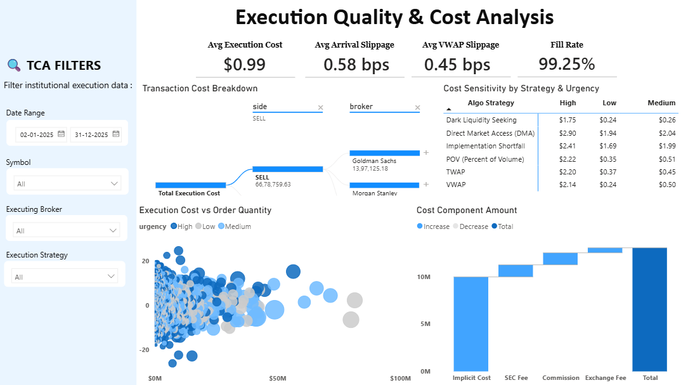

# 📊 Institutional Transaction Cost Analysis (TCA) & Execution Quality Optimization


An end-to-end **Institutional Transaction Cost Analysis (TCA)** and **Execution Quality Analytics Platform** developed for buy-side asset managers, quantitative hedge funds, and head of trading desks. This platform benchmarks **100,000 institutional equity orders** totaling **$95.86 Billion in traded notional** across US equities to diagnose market impact, quantify execution slippage, rank broker league tables, and unlock **$1.4M – $2.1M in annual execution savings**.

---

## 📌 Executive Summary & Macro KPIs

Institutional trading costs represent a substantial drag on investment returns. Traditional desks focus excessively on explicit broker commissions while remaining blind to the **"iceberg effect"** of implicit market impact and adverse selection.

```
+---------------------------------------------------------------------------------------------------------+
|                                    FY2025 MACRO EXECUTION SCORECARD                                     |
+--------------------------+--------------------------+--------------------------+------------------------+
|   Total Traded Flow      |   Total Execution Drag   |   Avg Arrival Slippage   |   Avg VWAP Slippage    |
|     $95.86 Billion       |   $13.01M (0.99 bps)     |         0.58 bps         |        0.45 bps        |
|     100,000 Orders       |   $130.15 / order        |    (Decision Benchmark)  |   (Interval Benchmark) |
+--------------------------+--------------------------+--------------------------+------------------------+
|     Overall Fill Rate    |   Implicit Cost Share    |   High-Urgency Cost %    |   Annual Savings Target|
|         99.25%           |    76.4% ($9.95M)        |      42.5% ($5.53M)      |    $1.40M - $2.10M     |
+--------------------------+--------------------------+--------------------------+------------------------+
```

---

## 🖥️ Interactive Power BI Dashboards

### Page 1: Institutional Transaction Cost Analysis (TCA)
*Executive benchmarking of broker performance, algorithmic strategies, and venue routing matrices.*



#### Core Features & Visuals:

- Provides a comprehensive overview of **institutional trading activity and execution performance.**

- Displays key KPIs such as **Total Notional Traded, Total Orders Executed, Average Arrival Slippage, Average VWAP Slippage, and Total Execution Cost.**

- Compares **broker performance** based on Arrival Slippage and VWAP Slippage to understand differences in execution quality.

- Analyzes **average execution costs across different algorithmic strategies**, including DMA, Implementation Shortfall, POV, TWAP, VWAP, and Dark Liquidity Seeking.

- Provides a **broker and trading venue cost comparison** across exchanges and execution venues.

- Includes interactive filters for **Date Range, Symbol, Executing Broker, and Execution Strategy.**
---

### Page 2: Execution Quality & Cost Breakdown
*Deep microstructure diagnostics, root-cause decomposition, and order urgency sensitivity.*



#### Core Features & Visuals:
- Provides a detailed view of **execution quality and the factors contributing to overall transaction costs.**

- Highlights key metrics including **Average Execution Cost, Average Arrival Slippage, Average VWAP Slippage, and Fill Rate.**

- Uses a **Transaction Cost Breakdown** to analyze execution costs by trade side and broker.

- Compares **cost sensitivity across different execution strategies and urgency levels** such as High, Medium, and Low.

- Visualizes the relationship between **execution cost and order quantity**, with order urgency represented through the chart.

- Breaks down the **total execution cost** into components such as Implicit Cost, SEC Fee, Commission, and Exchange Fee.


---

---

## 📂 Repository File Structure

```
├── README.md                            <- Project 
├── TCA Report.pptx                      <- Executive PowerPoint Deck
├── Trades.csv                           <- 100,000 Institutional Execution Records
├── TCA.pbix                             <- Dashboard
```

## 🚀 How to Recreate & Run

 **Explore the Power BI Dashboard:**
   - Open your Power BI Desktop application.
   - Load the Power BI project file and connect to `tca_trade_executions.csv`.


---

## 👤 Author & Acknowledgments

- **Author:** Khushal
- **Role:** Data Analyst / Finance Enthusiast
- **Project Domain:** Institutional Equity TCA & Execution Microstructure Analysis
